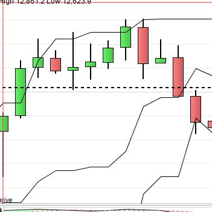
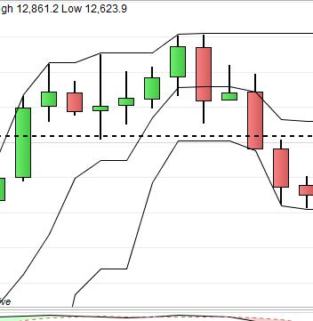

# PRT-New_Donchians

## Summary
This is an implementation of the Donchian channel indicator for ProRealTime v10.3.

## The code
The code is pretty simple. You can copy-n-paste it into ProRealTime's indicator editor.

***
    // SAMPLEPERIOD - the number of bars to measure HI/LO
    ONCE SAMPLEPERIOD = 6
    
    DonchianHIGH = highest [SAMPLEPERIOD] (High)
    DonchianLOW = lowest [SAMPLEPERIOD] (Low)
    DonchianMID = (DonchianHIGH + DonchianLOW) / 2
    
    RETURN DonchianHIGH AS "DonHI", DonchianMID AS "DonMID", DonchianLOW AS "DonLO"
***

If you want to change the number of periods that are covered by the Donchian bands then you alter the **SAMPLEPERIOD** variable.

This variable does not change during the operation of the indicator and so it is marked up as **ONCE** (use this once).

Here is a download of a pre-compiled binary version of this indicator for importing directly (right-click, "Save as"): <A href="New_Donchians.itf">[New_Donchians.itf]</a> 

## Usage
Usage of this indicator should be fairly easy;

- install the New_Donchians indicator on your version of ProRealTime (v10.3), either by directly inputting the source code to a new indicator or by importing the .itl file provided.
- open a chart of the instrument you want to monitor
- Click on the 'Price' tab
- select 'Add indicator' from the drop-down menu
- select 'New_Donchians' from the list of indicators
- you will then be shown a window where you can modify the appearance of the indicator on your chart

To remove the New_Donchians indicator from your chart, press the 'Alt' key and click the New_Donchians tab on the chart.

## What it does
The Donchian channel is an indicator used in market trading developed by Richard Donchian. It is formed by taking the highest high and the lowest low of the last n periods. It can be considered as an indicator for the price volatility of the instrument being monitored.

## Advanced usage
By default the New_Donchians indicator indicates the highest price and  the lowest price that an instrument has displayed in the last 6 time periods. If you want to change the number of time periods that are covered by this indicator then you can change the value of the **SAMPLEPERIOD variable** in line 1.

This indicator returns the values of the highest price value, the lowest price value and the 'midpoint' of those as variables that can be used by other indicators. It does this by reurning the following variables:
- DonHI - the value of the upper Donchian band
- DonLO - the value of the lower Donchian band
- DonMID - the 'simple' halfway value between DonHI and DonLo ie.  (DonHI - DonLO) / 2

# Why was this indicator created?
The first version of ProRealTime I used was v10.3 on a candlestick chart. I noticed that sometimes a candlestick would either mark a high above the upper Donchian band or, a low below the lower band. The Donchian band would be marked correctly from the next candlestick. The graphics below should show some good examples of this behaviour.

<table>
<tr><td>ProRealTime v10.3 chart</td><td>&nbsp;&nbsp;&nbsp;</td><td>ProRealTime v11.1 chart</td></tr> 
<tr><td></td><td></td><td></td></tr>
</table>

Both graphics show the same instrument in the same timeframe. The graphic on the left shows the v10.3 screen and, on the right shows the v11.1 screen.  It should be easily to see where the candlesticks extend beyone the Donchian bands on the left hand graphic. These are both 'vanilla' setups so there should be no configurations that could affect them.

I thought/believed that this default v10.3 behaviour was probably not the best especially if you're working with multi-timeframes as a lower timeframe could get an erroneous figure for what the upper timeframe's Donchian values are.

